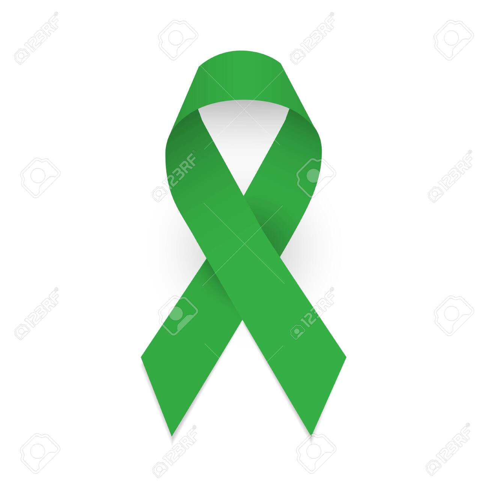

# Write a Definition Statement
### I want to build an application that provides assistance to people with disabilities and those diagnosed with cerebral palsy(cp) or their families to know the disease as well as the causes behind this disease and the signs and symptoms of this disease. My site also provides assistance to these people to know what are the most important exercises that they should do during physical therapy sessions and Occupational therapy sessions and the best exercises that they should do during the day to make it like a daily routine. My site also provides many articles,stories documentaries, and motivational books that help them develop their mental and physical abilities and To give them hope, passion, and energy to change them for the better,My website also helps these people communicate with families and people with the same disease to share their experiences, opinions, and information. This will benefit everyone,Finally, my website provides assistance and financial support to those people with this disease who are unable to purchase medical tools (equipments) or perform operations because these types of operations and medical tools(equipments) are expensive.
# Define your Audience

### People with a diagnosis cerebral palsy, Families of people with CP (cerebral palsy) and Organizations and institutions related to this disease

# Who is using my website
#### Highlighted below in the Mural
# Outline the content of the website
## What do I want on each page?
#### Highlighted below in the Mural
## What do I want the functionality of each page to be?
#### Highlighted below in the Mural
## What is the purpose of my application?
#### See definition statement above.
## What business problem or real world problem am I going to be solving?
#### My website solving an important point, which is that people with this disease (CP) suffer from frustration, isolation, difficulty thinking, and psychological and physical exhaustion.  Therefore, the site solves these points by presenting information in a simple and uncomplicated way and providing solutions to the problems they face in a way that is easy to understand and apply and it will save them time and effort.
# Define the attributes of your website
### Color Palette /rgba(224, 230, 245, 0.86)
### Images I will upload in the site  a group of pictures of children with Cp, and I will also upload in the site pictures of medical tools and equipment for these people with this disease, as well as a several of motivational pictures for them.
### Fonts / i will use  font-family 'Times New Roman', Times, serif /font-size: 1.1rem;
### Logos!
### Navigation: Navigation links on each page. on Top right the traditional method of use is via mobile, and left sidebar for desktop.

# Create and provide link to User Story Map in Mural
### https://app.mural.co/t/zaidsworkspace1777/m/zaidsworkspace1777/1693516400625/df1a64128b6530d24a58e66099706d11602b9726?fromVisitorModal=true&sender=u4179bbdce1afbc45b2bf9328
# Research the following:
## List Applications Researched:
1. ### https://ucp.org/
2. ### https://www.cerebralpalsy.org/
3. ### https://www.nhs.uk/conditions/cerebral-palsy/
# List what you like about each site:
1. ### easy navigating.
2. ### The front end of the website is attractive.
3. ### Providing financial support to those in need.
# List what you do not like about each site:
1. ### Not mediating between the person with (cp) and the company that produces medical equipment In order to facilitate the process of purchasing and delivering medical equipment to the person concerned.
2. ### There is no special field as a forum for people with this disease or anyone or their relatives to communicate with each other, because this thing is useful for them to share opinions and experiences.
3. ### These sites do not provide a special field that helps the visitor by providing him with a range of entertainment and activities.
# How my website will be different:
1. ### I will provide the user with ease of navigation and receiving information simply. I will also provide the fields mentioned above (List what you do not like about each site:).
2. ###  allow people to buy and sell disability equipment. Disability equipment can be expensive

# Create wireframes and provide link for each page (minimum of 4-5 pages) including Home, About Me, Contact Us and 1-2 other pages demonstrating the specific functionality of your capstone's purpose
# Create and provide link to User Flow Diagram
1. ### https://app.diagrams.net/#G1PfbPuGUJbOqlbv3lI614TXvTpN-e-KWK (HOME PAGE).
2. ### https://app.diagrams.net/#G15QYvyLmRQcLtO1oVmFjuzt1CknKlMOxc (PAGE 2 ABOUT CP).
3. ### https://app.diagrams.net/#G1PDxH-0e9J0evDDgmy5Fbbo7EjfZD3h0w (PAGE 3 CONTACT US).
4. ### https://app.diagrams.net/#G171Zq3DGpl-3OwUNjFY1ca_s_-hD32W3f (PAGE 4 ABOUT US).
5. ### https://app.diagrams.net/#G1CRXx7AkijKNVZw7zquiqHwzT2We5wRWj (PAGE 5 ENTERTAINMENT).
# Create and provide link to SWOT Analysis
### https://docs.google.com/document/d/1JgZNS0olicaeMThS3u-rNtAenM4nuPHc8x3wERDwfkY/edit
